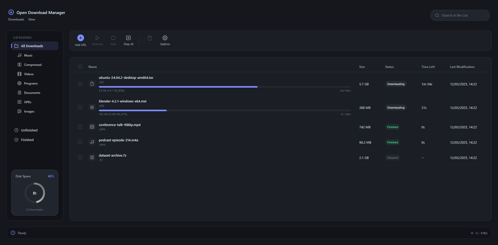
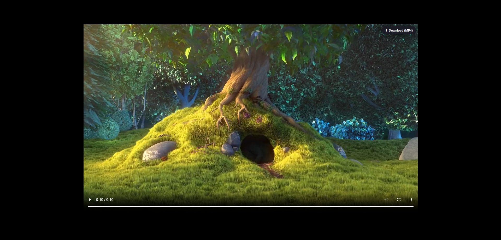
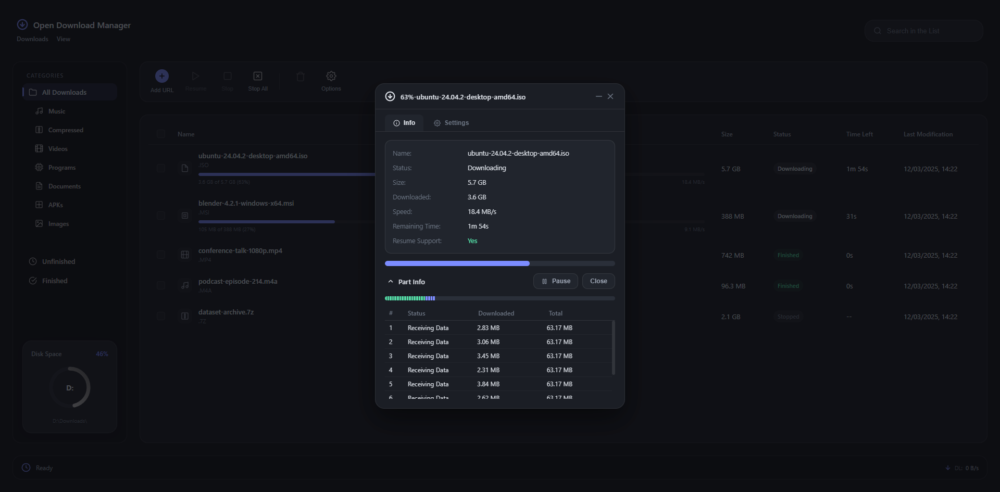
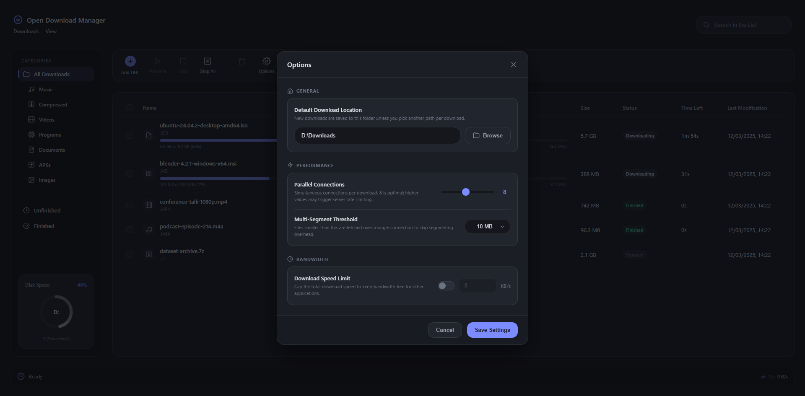
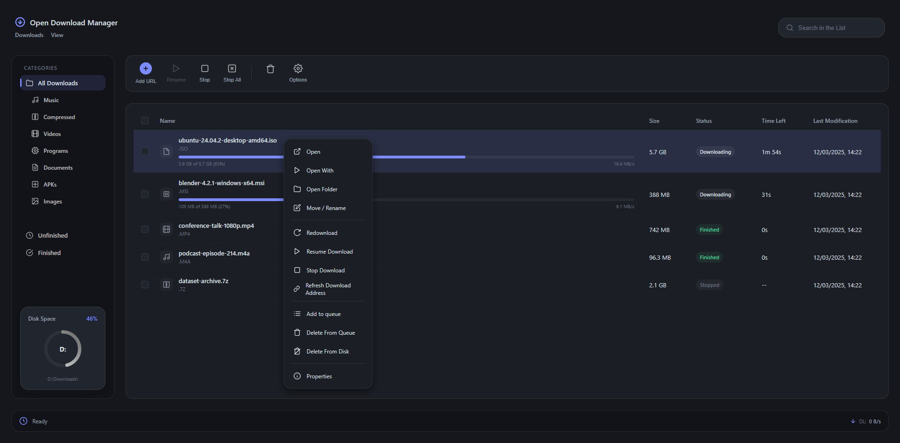

# ODM — Open Download Manager

A multi-segment download manager for Windows with a browser extension that
captures video from the page. Written in C++17, with the interface built as a
web page and rendered by [Ultralight](https://ultralig.ht).



---

## What it does

- **Multi-segment HTTP downloads.** The file is pre-allocated and split into
  many small chunks; connections work on different regions at once and a
  connection that runs dry steals pending work, so no single slow chunk holds
  up the tail.
- **Resume that survives a restart.** Progress is kept in a sidecar next to the
  file, so an interrupted download continues where it stopped rather than
  starting over.
- **Video capture from the browser.** The extension watches page media and
  offers a download button over the video you are actually watching — plain
  files, HLS/CMAF streams, and the paired video/audio streams Instagram and
  Facebook use.
- **Lossless remux.** When a stream ships video and audio separately, both
  tracks are downloaded and merged with libavformat. Codecs are copied, never
  re-encoded.
- **Nothing is lost on hand-off.** The extension only cancels Chrome's own
  download *after* the app confirms it accepted the job.

---

## Browser integration

The app runs a small HTTP bridge on `127.0.0.1:47923`, bound to loopback only
and authenticated with a token that is regenerated on every launch. The
extension talks to it over that bridge.

```
┌──────────────────────── Chrome ────────────────────────┐
│                                                        │
│  downloads.onDeterminingFilename ──┐                   │
│  (a normal browser download)       │                   │
│                                    ├──► background.js  │
│  webRequest media sniffer ─────────┤   (service worker)│
│  (mp4 / m3u8 / DASH rungs)         │         │         │
│                                    │         │         │
│  content.js  ── floating panel ────┘         │         │
│  over the video on screen                    │         │
│                                              │         │
│  mse_probe.js (page world)                   │         │
│  binds the playing <video> to its real URLs  │         │
└──────────────────────────────────────────────┼─────────┘
                                               │
                       POST /add  +  X-ODM-Token, cookies,
                       referrer, User-Agent, suggested name
                                               │
                                               ▼
┌──────────────────────────── ODM ───────────────────────┐
│  BridgeServer ──► Add-URL dialog, prefilled             │
│                        │                                │
│                        ▼        route by job type       │
│         Downloader ── HlsDownloader ── DashDownloader   │
│         (plain HTTP)   (m3u8/CMAF)     (paired tracks)  │
│                        └────────┬──────────┘            │
│                                 ▼                       │
│                          Muxer (libavformat)            │
└─────────────────────────────────────────────────────────┘
```

**Two ways a download reaches the app.** A normal browser download is
intercepted before Chrome writes anything to disk and handed over with the
cookies, referrer and User-Agent that made it work in the browser — the reason
a link that needs a session still downloads correctly outside it. A page video
is offered through a floating panel over the player.



The panel names what you actually get: a plain file by size, an HLS master as
"video + audio" with its resolution, and a silent CMAF track labelled as such,
so a stream is never handed over as if it were a finished file. Clicking it
sends the URL to ODM, which opens its Add-URL dialog prefilled.

**Picking the right video.** On sites that stream through Media Source
Extensions, every `<video>` carries a `blob:` source and a feed keeps a dozen
unrelated clips buffered at once, so nothing in the network traffic says which
clip is on screen. Ranking candidates by size or recency is a guess, and
guessing wrong hands you a different video. `mse_probe.js` instead watches the
player itself — `createObjectURL`, `addSourceBuffer`, `appendBuffer` and the
`fetch` responses feeding them — and binds the element you are watching to the
exact URLs behind it. On a page with 17 buffered clips this resolves to a
single candidate.

**Installing the extension.** It is not on the Chrome Web Store, so load it
unpacked: open `chrome://extensions`, turn on *Developer mode*, choose *Load
unpacked* and pick the `extension/` folder. Start ODM first — the extension
polls the bridge and picks up its token automatically; the popup shows whether
it is connected.

---

## Screenshots

Per-connection view of a running download, with the segment map and the
resume state reported by the engine:



Settings — download location, connection count, the size below which
segmenting is skipped, and a global speed cap:



Per-download actions:



---

## Building

**Requirements**

- Windows, Visual Studio 2022 (x64)
- CMake 3.20+
- [vcpkg](https://vcpkg.io) for the third-party libraries
- The Ultralight SDK — **not included in this repository**

**Dependencies** (via vcpkg)

```bash
vcpkg install curl ffmpeg libmediainfo
```

**Ultralight SDK.** Download the SDK from [ultralig.ht](https://ultralig.ht)
and place it at `ultralight-sdk/` in the repository root, so that
`ultralight-sdk/include/` and `ultralight-sdk/lib/` exist. It carries its own
licence and is deliberately kept out of version control.

**Configure and build**

```bash
cmake --preset default
```
```bash
cmake --build build --config Release
```

The executable lands in `build/Release/ODM.exe`, with `assets/` copied beside
it. Ultralight loads the interface from that folder at startup, so changing a
file under `assets/` only needs a restart, not a rebuild.

---

## Project layout

```
src/
  main.cpp              entry point (single-instance mutex)
  ODMApp.{h,cpp}        window, JS bindings, tray icon, bridge glue
  Downloader.{h,cpp}    multi-segment HTTP engine (libcurl)
  HlsDownloader.{h,cpp} HLS/CMAF: playlists, byte ranges, AES-128, dual tracks
  DashDownloader.{h,cpp} paired-track DASH (Meta CDNs): video rung + audio rung
  Muxer.{h,cpp}         libavformat stream-copy remux into one .mp4
  BridgeServer.{h,cpp}  loopback HTTP bridge (WinSock)
assets/                 the interface: index.html, app.css, app.js
extension/              Chrome extension (Manifest V3)
```

The interface is an ordinary web page, so `assets/index.html` can be opened in
a browser to work on the layout without launching the app. Everything native
is exposed to it as a handful of JavaScript functions.

---

## Roadmap

- [x] Multi-segment HTTP downloads with resume
- [x] Browser extension with download interception
- [x] Video sniffing with an in-page download panel
- [x] HLS/CMAF engine with separate-audio remux
- [x] Paired-track DASH (Instagram / Facebook)
- [x] Identity-based capture on MSE players
- [ ] Download queue with several simultaneous jobs
- [ ] Pause per job, not just a global stop
- [ ] DASH manifest (`.mpd`) engine
- [ ] YouTube support
- [ ] Long VODs (Twitch / Kick): streaming concat so a 30 GB recording does not
      need twice its size in free space, and playlist refresh for URLs that
      expire mid-download
- [ ] Scheduler and category rules
- [ ] Checksum verification

---

## Notes

The bridge listens on loopback only and rejects requests without the current
token, so nothing outside the machine can queue a download.

## Licence

Licensed under the Apache License 2.0 — see [`LICENSE`](LICENSE).

Third-party components keep their own terms. The Ultralight SDK is licensed
separately and must be obtained from its vendor; FFmpeg (libavformat/libavcodec)
and libcurl carry their own licences, which matter in particular if you
distribute a compiled binary rather than source.
